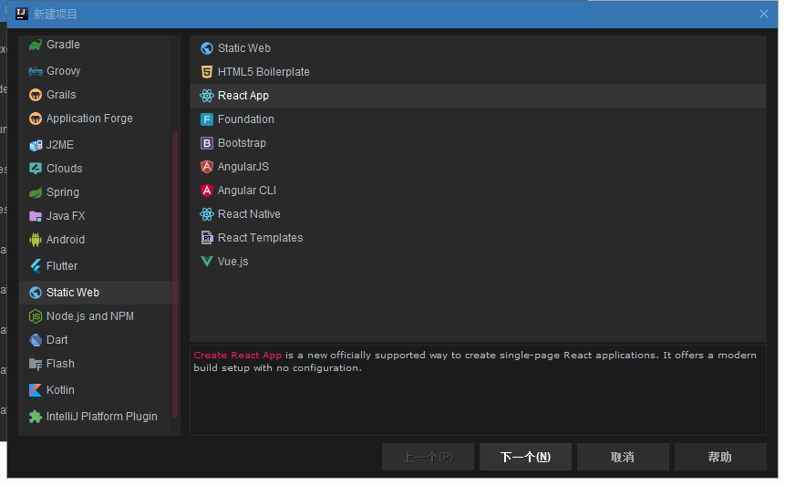
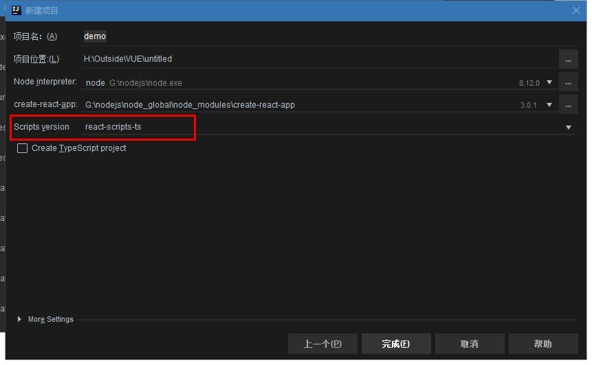

# 使用IDE创建工程






# 定义模板

```tsx
import * as React from 'react';
const initialState = {}
interface IProps extends React.HTMLAttributes<HTMLDivElement> {}
type State = typeof initialState
class ${NAME} extends React.Component<IProps, State> {
	public state: State = initialState
	public render() {
		return (
			<div className="${NAME}">
				${NAME}
			</div>
		);
	}
}
export default ${NAME}
```

# 没有定义类型，默认any

```json
"noImplicitAny": false,
```


# Axios

## 封装

安装

```shell
$ yarn add axios qs @types/qs -S
```

> axios:发送HTTP请求工具[【文档】](http://www.axios-js.com/)
>
> qs:URL转换工具[【文档】](https://www.npmjs.com/package/qs)
>
> @types/qs：qs库默认不支持在ts文件中使用，@types包中都是支持ts的一些库

封装中将会使用type类型，工程里的tslink，不建议使用type，在这里配置一下

**tslint.json**

```json
"rules": {
    "interface-over-type-literal": false
}
```

> 遇见一些tslink的问题都可以在[【文档】](https://palantir.github.io/tslint/)中查找

**axios-config.js**

```js
import axios from 'axios'

const service = axios.create({
    baseURL: '',
    timeout: 2500
})
service.interceptors.request.use(config => {
    return config;
}, error => {
    return Promise.reject(error)
})
service.interceptors.response.use(res => {
    return res.data.result
}, error => {
    return Promise.reject(error)
})
export default service
```

**IAxios.ts**

```tsx
import * as qs from 'qs'
import axios from './axios-config'

type MethodType = (typeof MethodTypes)[number]
declare const MethodTypes: ['get', 'post', 'delete', 'put']
declare type  parms = {
  url: string,
  args?: any,
  method?: MethodType
}
export default class IAxios<T> {
  private url: string
  private args: {}
  private method: MethodType
  
  constructor({url, args = {}, method = 'get'}: parms) {
    this.url = url;
    this.args = args;
    this.method = method;
  }
  
  public ajax = (): Promise<T> => new Promise<T>((resolve, reject) => {
    let promise
    let {url} = this
    const {args, method} = this
    if (method === 'get') {
      if (args !== {}) {
        url = url + '?' + qs.stringify(args)
      }
      promise = axios.get(url)
    } else {
      promise = axios[`${method}`](url, {data: args})
    }
    promise.then((res: T) => {
      resolve(res)
    }, err => {
      reject(err)
    })
  })
}
```

## 使用

定义一个json来模拟后端给的数据

**public/api/Admin.json**

```json
{
  "code": 1,
  "message": "success",
  "result": {
    "id": 1,
    "name": "xxx"
  }
}
```

根据这个数据定义接口

**model/AdminModel.ts**

```ts
export default interface IAdminModel {
  id: number
  name: string
}
```

定义一个api

**api/AdminAPI.ts**

```ts
import IAxios from "../utils/axios/IAxios";
export default class Admin {
  public getAdmin = () => new IAxios({url: '/api/Admin.json'})
}
```

tsx中，控制台输入被禁用了

```json
 "rules": {
    "no-console": false
  }
```

**App.tsx**

```tsx
import * as React from 'react';
import AdminAPI from "./api/AdminAPI";
class App extends React.Component {
  public async componentWillMount() {
    const iAdminModel = await AdminAPI.getAdmin();
    console.log(iAdminModel);
  }
  
  public render() {
    return (
      <div className="App">
        App
      </div>
    );
  }
}
export default App;
```

# 路径优化

```shell
$ yarn add react-app-rewired@1.6.2 -D
```

> 给路径加别名，需要在webpack中进行配置，但这个工程里没有暴露配置，可以通过react-app-rewired插件来配置

**package.json**

```json
"scripts": {
    "start": "react-app-rewired start --scripts-version react-scripts-ts",
    "build": "react-app-rewired build --scripts-version react-scripts-ts",
    "test": "react-app-rewired test --env=jsdom --scripts-version react-scripts-ts",
    "eject": "react-scripts-ts eject"
  },
```

**config-overrides.js**

```js
const path = require('path')
module.exports = function override(config, env) {
    config.resolve.alias = {
        ...config.resolve.alias,
        '@utils': path.resolve(__dirname, 'src/utils'),
    }
    return config;
}

```

**tslint.json**

```json
"no-implicit-dependencies": ["optional", ["src"]]
```

**tsconfig.json**

```json
{
 "paths": {
      "@utils/*": ["./src/utils/*"]
  }  
},
"exclude":[...]
```

